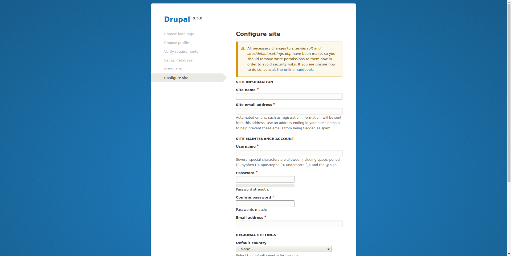
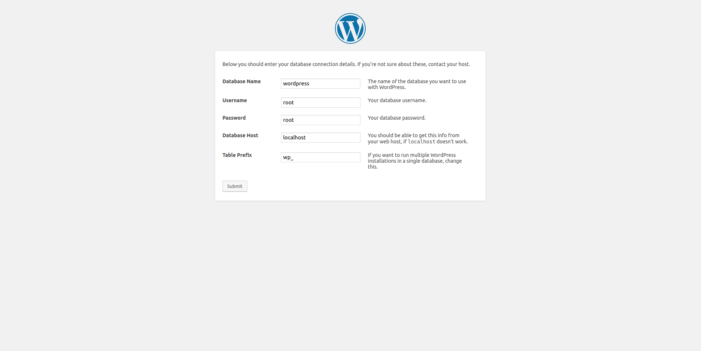

# Installatie Vagrant en VirtualBox
* Requirements
     * vagrant.msi bestand (https://www.vagrantup.com/downloads.html)
     * VirtualBox.exe bestand (https://www.virtualbox.org/wiki/Downloads)
* Stappenplan
     * Open de het installatiebestand virtualbox.exe en volg de stappen tot de installatie afgerond is.
     * Nadat VirtualBox correct geïnstalleerd is, voert u het bestand vagrant.msi uit. Volg de stappen op het scherm.

# Installatie Virtuele machine met Vagrant
* Requirements
     * Virtualbox
     * Vagrant
* Stappenplan
     * Voordat u de virtuele machine kan downloaden moet u eerst de vagrantfile en het script downloaden. Plaats beide bestanden in één zelfde map. De bestanden kan u vinden op deze link: https://github.com/HoGentTIN/p2ops-g11/tree/master/opdracht02/Scripts/LAMP
     * Open een command prompt of powershell venster en navigeer naar de map waar de vagrantfile en het script zich bevinden. Een andere aanpak hiervoor is shift + right click -> 'open command prompt window here'.
     * Om de download van de virtuele machine te starten voert u het volgende commando uit: vagrant up. Na enkele minuten is de virtuele machine klaar voor gebruik onder de naam LAMP CLI in uw VirtualBox client.

# Installatie LAMP
* Requirements
    * Installatie van CentOS via vagrant en de Vagrantfile.
* Stappenplan
    * Na het uivoeren van het commando 'Vagrant Up', zal de virtuele machine voor de eerste keer worden opgestart. Tijdens deze stap zal het shell script voor de installatie van LAMP worden uitgevoerd. 
    * Na de uitvoering van het script wordt een nieuw bestand aangemaakt met de naam 'info.txt'. Dit kan u geraadpleegd voor de informatie over uwe LAMP instalatie.
    * Het script gaat nu automatisch verder met de installatie van WordPress en/of Drupal 

# Installatie Drupal en/of WordPress
* Requirements
    * LAMP werd geïnstalleerd volgens het script *LAMP.sh*
* Stappenplan
    * Het script vraagt of u Drupal wilt installeren, je kan dit bevestigen met [ENTER], [Y] of [y]. Indien u dit niet wenst niet doen, geef dan [n] of [N] in.
    * Na de installatie van Drupal kan u de configuratie raadplegen via uw webbrowser : [ip-address-server]/drupal
    
# MariaDB / MySQL
* De gegevens voor de connectie met de mariadb database kan u terugvinden in het bestand info.txt. Dit bestand vindt u in de map waar het script uitgevoerd werd (meestal in /home/vagrant). In dit bestand vindt u het volgende:
    * Root wachtwoord (enkel voor intern gebruik (localhost))
    * Gebruikersnaam en wachtwoord voor de gebruiker die externe toegang heeft tot de databases
      
# FTP
* Om makkelijker een website online te zetten werd ftp geïnstalleerd. Het server adres is het ip adres van de machine waarop het script werd uitgevoerd. De gebruikersnaam en het wachtwoord zijn dezelfde als het systeem (door de gebruiker ingesteld). Deze verbinding gebeurd via poort 22.
    
# Configuratie Drupal
* Na de installatie van Drupal kan de configuratie wizard geraadpleegd worden via de browser. 
Ga hiervoor naar het volgende adres: [ip-address-server]/drupal
* Als de pagina geladen is zou u onderstaand scherm te zien moeten krijgen. Indien dit het geval is dan is drupal correct geïnstalleerd. Als u dit scherm niet ziet dan kan u best nagaan ofdat het ip adres van de server klopt. Kies uw taal en klik op 'Save and continue' om door te gaan.

* Kies hier welk type installatie u wilt uitvoeren en klik nogmaals op 'Save and continue'   

* Bij de volgende stap gaat drupal controleren ofdat alles in orde is voor de installatie, als er geen errors of warnings zijn klik dan op 'Save and continue'. Als er zich errors voordoen dan moet de installatie van drupal opnieuw uitgevoerd, dit kan u doen door de map "/var/www/html/drupal" te verwijderen. Als er warnings zijn kan u ervoor kiezen om op 'retry' of 'Continue anyway' te klikken.

* Het volgende venster heet 'Database configuration'. Hier dient u de instellingen in te voeren voor de connectie met de database. Deze informatie is terug te vinden in het bestand 'info.txt'. Dit bestand vindt u in de map waar u het script hebt uitgevoerd (meestal in /home/vagrant).
    * Database type: kies hier voor MySQL, MariaDB, Percona Server, or Equivalent (dit staat standaard aan)
    * Database name: Vul 'drupal' in (zonder quotes)
    * Database username: Vul 'root' in (zonder quotes)
    * Database password: Vul nogmaals 'root' in (zonder quotes)
    * Klik vervolgens op 'Save and continue'

* De installatie van drupal begint. Na de installatie kan u zelf sites configureren. Klik vervolgens op 'Save and continue'

# Configuratie WordPress
* Na de installatie van WordPress kan de configuratie wizard geraadpleegd worden via de browser.
Ga hiervoor naar het volgende adres: [ip-address-server]/wordpress
* Als de pagina geladen is, zou u onderstaand scherm moeten zien. Indien dit het geval is, dan is WordPress correct geïnstalleerd. Als je geen scherm ziet dan kan u best nagaan ofdat het ip adres van de server klopt. Op het eerste scherm geeft WordPress een overzicht wat er allemaal gaat gebeuren gedurende de installatie. Klik op 'Let's go!' om de installatie te starten.

* WordPress heeft voor de installatie enkele database gegevens nodig. De velden *Database Name* en *Prefix* mogen vrij worden ingevuld. De waarden voor de velden *Username* en *Password* vind je terug in het bestand 'info.txt' (meestal in /home/vagrant). In het veld *Database host* vult u 'localhost' in.

* WordPress bevestigd de gegevens en is klaar voor installatie.
      * Klik op 'Run the installation'.

* Nu krijgt u de mogelijkheid om een WordPress website aan te maken. Vul de gegevens in en klik op 'Install WordPress'.

**Installatie LAMP werd beëindigd.**
     
