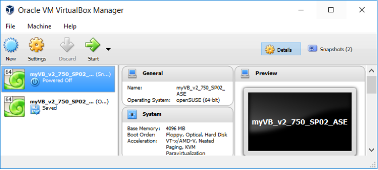
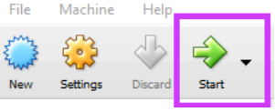
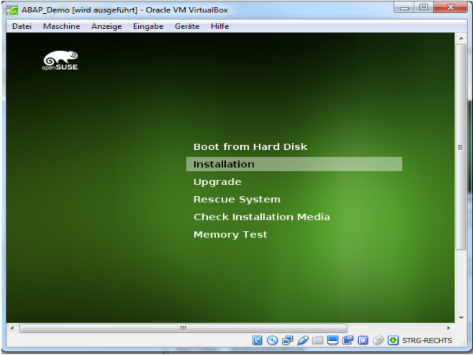
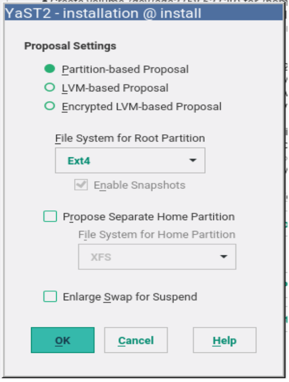
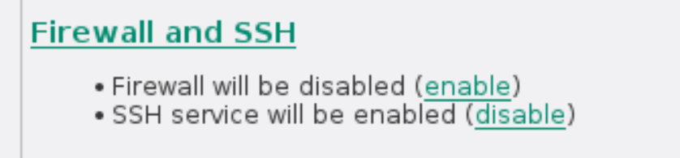
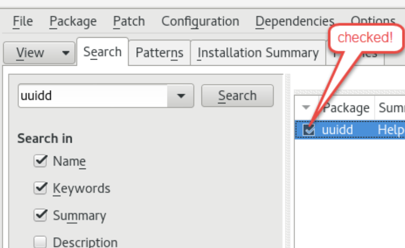
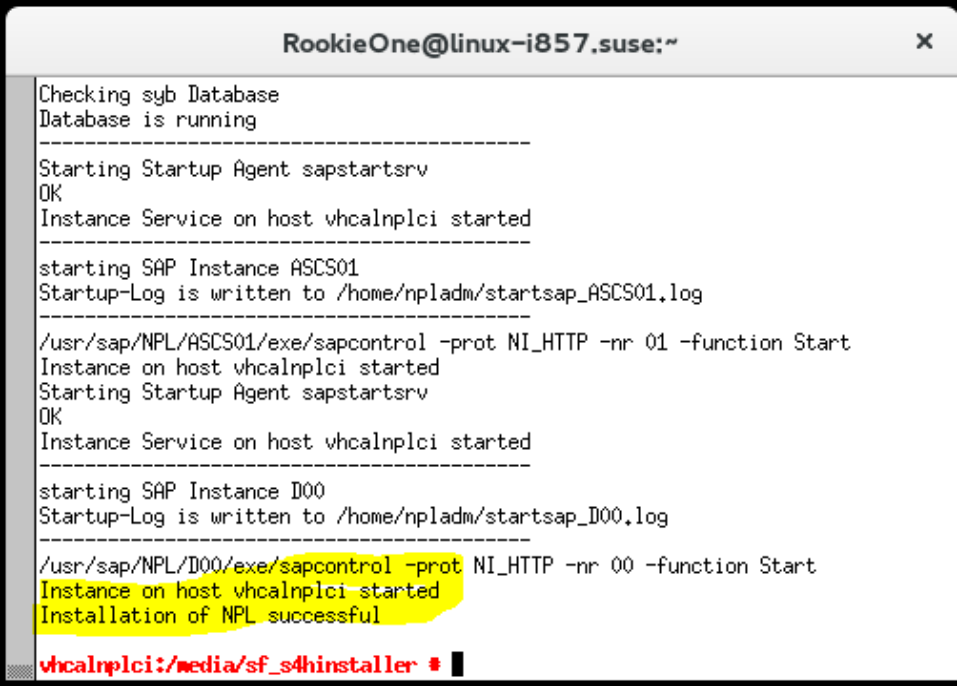

# Installatie van SAP in op openSUSE #

## Voorbereiding ##

De Volgende zaken zijn vereist:  
 - x86_64 Processor  
 - 16 GB RAM plus 8 GB swap space  
 - 100 GB vrije ROM geheugen voor de server  
 - 2 GB vrije ROM geheugen voor de cleind  
 - de taal van het systeem moet in het English zijn  
 - Installatie van VirtualBox  https://www.virtualbox.org/wiki/Downloads  
 - Installatie van openSUSE https://software.opensuse.org/distributions/leap  
 
 ## Creeëren van een VirtualBox en het installeren van openSUSE ##
 
 
 
De instellingen stel u in als volgend:
- Name : MyVirtualLinux
- Type : Linux
- Version: openSUSE (64 bit) -> volgende
- Select Memory size : 6 GB  -> volgende
- Hard schijf: Maak een virtual hard disk nu -> volgende
- Hard schijf file type: VHD (Virtual Hard Disk) -> volgende
- Opslag: Dynamically allocated -> volgende
- File locatie and grote: 100 GB
- Creeër.

 
 - Klik op start
 - er zal een dialoog tevoorschijn komen, hier geef je de openSUSE distributie
 - Druk op de installatie knop
  
  - accepteer de License Agreement
  - Installatie optie laat de 2 opties uitgevingt
  - In Suggested Partitioning keis voor Edit Proposal Settings
  - Stel alles in via deze opties
   
   
   - Selecteer je Region en tijdzone
   - In de Desktop Selection selecteer GNOME
   - Vul je naam, user name, password in
   - Scorl naar benenen en en stel de ssh, Firewall in op deze manier 
   
   
   
   ## ABAP installation ##

- Installatie ABAP files https://tools.hana.ondemand.com/#abap  
- Het uitpakken van deze bestanden.  
- Open YaST (Activities -> Typ “Y” in de zoekbalk)  
- Typ het root paswoord
- Open de zoek balk en zoek uuidd en instaleer dat
 
- Open de zoek balk en zoek nano en instaleer dat

- Open Xterm
- Start uuidd via *sudo service uuidd start*
- Verander de hostnaam door via *sudo nano /etc/hostname*
- Verplaats de naam met *vhcalnplci*
- Restart het netwerk *sudo rcnetwork restart*
- Voeg de static ip adress toe *sudo nano /etc/hosts*
- voeg deze lijn toe *10.0.2.15 vhcalnplci vhcalnplci.dummy.nodomain*

- Ga binnen in de root binnen *sudo -i*
- Ga naar de de locatie waar de sap bestanden in zitten en typ het commando *chmod +x install.sh*

- Als alles goed gelukt is, zou u dit moeten uitkomen

