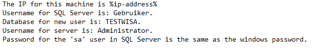

# Installatie WISA
* Requirements
    * Installatie van Windows Server 2016 via vagrant en de Vagrantfile
    * VagrantFile en het installatiescript moeten zich in dezelfde map bevinden op het hostsysteem van de gebruiker
    * VirtualBox en Vagrant moeten op het hostsysteem geinstalleerd staan.  
  	
## Stappenplan

### 1. Initialisatie: installatie vagrant
* Surf naar volgende website en kies je OS [Vagrant Download](https://www.vagrantup.com/downloads.html)
* En voer de setup uit, door op "Next" te klikken.
* Voltooid de installatie
* Herstart nu het hostsysteem

### 2. Installatie WISA
* Plaats de vagrantfile en het WISA.ps1 bestand in dezelfde directory (best c:\Users\$user, dit is ook het standaard pad waarin powershell opstart, indien een andere pad voer in powershell `cd GEKOZENPAD`)
* Open powershell en voer `vagrant up`in
* Nu moet de gebruiker de instellingen voor zijn machine kiezen.    
    

* Nu wordt de configuratie van je machine uitgevoert dit zal enige tijd in beslag nemen. Zorg voor een snelle en stabiele internetverbinding.
* Nadat het script is afgelopen, moet het systeem herstart worden. 

### 3. Configuratie	
Alle nodige configuratie gegevens kan men terugvinden `c:\config.txt` bestand.  
 

Uw machine is nu klaar om uw webapplicaties te hosten!
