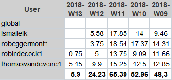

# Lastenboek Taak 2: APPServers

## Deliverables

(Som hier de concrete resultaten die van deze opdracht verwacht worden. Verwijder dan ook deze uitleg.)

Demo tijdens de contactmomenten van:

- Testomgeving met VirtualBox voor alle gevraagde platformen:
    - Toon hoe de VMs kunnen geïnitialiseerd worden.
    - Toon hoe een webapplicatie op de VM kan geïnstalleerd worden (aan de hand van een webapplicatie met een database-backend) en hoe een ABAP-ontwikkelaar met de SAP-omgeving kan werken
- Proof-of-concept met een public cloud platform van één van de webapplicatieservers, geïnitialiseerd met hetzelfde installatiescript als de testomgeving.

Op Github:

- Lastenboek
- Alle achtergrondinformatie die jullie verzameld hebben om met de opdracht aan de slag te kunnen gaan
- Gedetailleerde technische handleidingen gericht naar andere teamleden over installatieprocedures en de gebruikte scripts
- Handleiding voor gebruikers (i.e. webapplicatie- of SAP-ontwikkelaar)
- Testplannen en testrapporten

## Deeltaken

### Backlog
- SAP Client 
- Deployment Public Cloud Platform

### Rob Eggermont
- Doornemen opdracht 2 
- Installatie Windows Server 2016
- Opzoeking installatie SQL Server via command line
- Installatie SQL Server via command line
- Opzoeking Vagrant Windows Terminal
- Powershell script samenstellen (samen met Ismail)
- Achtergrondinfo opzoeken .NET installatie via commandline
- Installeren .NET commandline
- Achtergrondinfo doornemen en aanvullen
- Achtergrondinfo WISA stack
- Opstellen handleiding WISA
- O2L: Testplan LAMP uitvoeren
- Testplan SAP opstellen 

### Ismail El Kaddouri
- Doornemen opdracht 2 
- Werking Vagrant opzoeken - testinstallatie CentOS 7
- ASP.NET - MySQL Server op Windows Terminal Server 2016
- Powershell script samenstellen (samen met Rob)
- MySQL installatie via Powershell
- Remote Publish op WISA realiseren + documenteren (abandoned)
- Achtergrondinfo WISA stack
- O2A: SAP opzetten (OpenSUSE)
- Achtergrondinformatie SAP op OPENSUSE

### Robin Decock
- Doornemen opdracht 2 
- Opzoeking werking LAMP 
- Opzoeking achtergrondinfo SAP NetWeaver - ABAP Application Server
- Installeren LAMP (samen met Thomas)
- O2A: SAP opzetten via Ubuntu (ABANDONED)
- Handleiding installatie SAP (OPENSUSE)

### Thomas Vandeveire
- Doornemen opdracht 2
- Opzetten fysieke test server CentOS
- Configuratie CentOS Server
- Opzoeken LAMP CentOS 
- Installeren LAMP (samen met Robin)
- Opstellen handleiding LAMP
- O2A: Testplan SAP uitvoeren
- Configuratie Vagrant LAMP

## Tijdbesteding

Gedetaileerde tijdsplanning op Trello

Labo uitvoeren:

| Student  | Geschat | Gerealiseerd |
| :---     |    ---: |         ---: |
| Thomas   |  60u00  |    55u40     |
| Robin    |  59u59  |    40u15     |
| Ismail   |  60u00  |    46u55     |
| Rob      |  60u00  |    54u00     |

Dit is de totale uitvoeringstijd zonder het uitwerken van de huidige backlog
(na oplevering van de taak een schermafbeelding toevoegen van rapport tijdbesteding voor deze taak)

 
