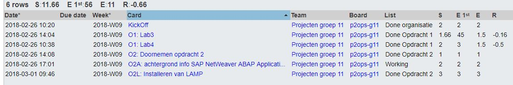
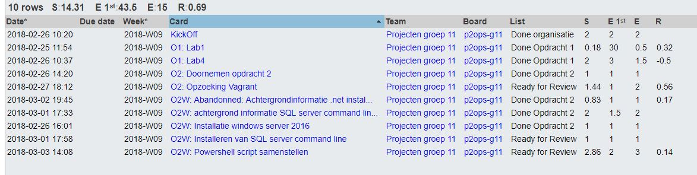
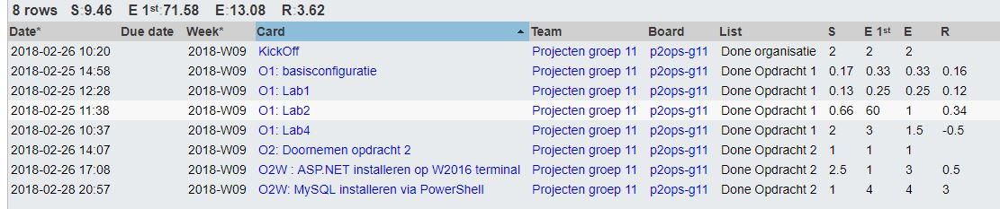
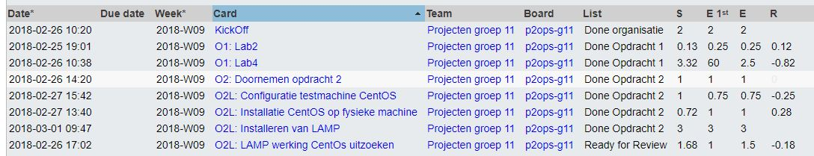

# Voortgangsrapport week 4

* Groep: 11
* Datum: 5/03/2018

| Student             | Aanw. | Opmerking |
| :---                | :---  | :---      |
| De Cock Robin       |   x   |     /     |
| Eggemont Rob        |   x   |     /     |
| El Kaddouri Ismail  |   x   |     /     |
| Vandeveire Thomas   |   x   |     /     |

## Wat heb je deze week gerealiseerd?

### Algemeen

[Afbeelding huidige toestand Kanban-bord(en) invoegen]

* Overlopen opdrachten
* Opzoekingen LAMP en WISA
* Basisscript LAMP en WISA opzetten

[Afbeelding teamoverzicht tijdregistratie onderverdeeld per deelopdracht]

### De Cock Robin

* Opzoeking LAMP stack
* Installatie LAMP zonder script

### Eggermont Rob

* Opzoeking WISA stack
* Basis script WISA uitschrijven

### El Kaddouri Ismail

* Opzoeking WISA Stack
* WISA installeren zonder script

### Vandeveire Thomas

* Opzoeking LAMP stack
* LAMP configureren zonder script
* Basis LAMP Script uitschrijven

## Wat plan je volgende week te doen?

### Algemeen
Volgende week verwachten we een eerste versie van beide scripten te kunnen opleveren. We zijn er ons van bewust dat deze zeker en vast nog bugs zullen bevatten, maar deze moeten werkend zijn.
### De Cock Robin
* Wordpress installatie mogelijk maken via Script
* Configureren van de MySQL stack
### Eggermont Rob
* SQL Server installeren via CLI
* Script WISA werkend krijgen
### El Kaddouri Ismail
* Opzoeking over .NET
* SQL Server connectie met .NET applicatie
### Vandeveire Thomas
* PHP en Apache configuratie via script
* Script LAMP werkend krijgen
## Waar hebben jullie nog problemen mee?

* SQL server installatie via CLI zonder user input
* Configuratie sql zonder gebruik van de command mysql_secure_installation en installatie php-7.2

## Feedback technisch luik

Uit de documentatie blijkt dat jullie een zekere start genomen hebben. 

De status is echter dat alles een draft is, en niet zo een leesbare status vertoont.
Zorg er voor dat je, naast het werk, ook voldoende zorg besteed aan de documentatie.

installatieScript: Met # kan je commentaar toevoegen, ipv gewoon commando's onder elkaar te zetten. Dit is een eerste verbeterstap.

### Algemeen

### De Cock Robin
### Eggermont Rob
### El Kaddouri Ismail
### Vandeveire Thomas

## Feedback analyseluik

### Algemeen

### De Cock Robin
### Eggermont Rob
### El Kaddouri Ismail
### Vandeveire Thomas

