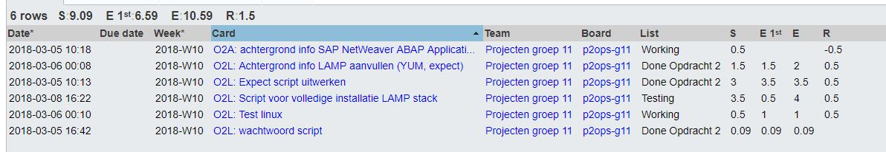
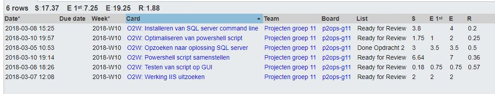
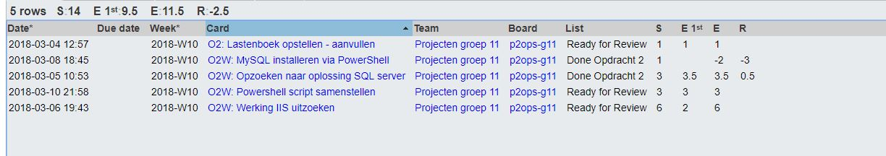
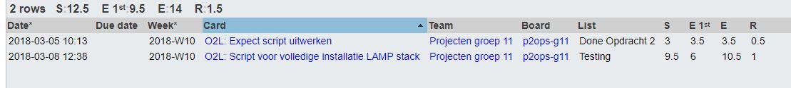

# Voortgangsrapport week 5

* Groep: 11
* Datum: 12/03/2018

| Student             | Aanw. | Opmerking |
| :---                | :---  | :---      |
| De Cock Robin       |   x   |     /     |
| Eggemont Rob        |   x   |     /     |
| El Kaddouri Ismail  |   x   |     /     |
| Vandeveire Thomas   |   x   |     /     |

## Wat heb je deze week gerealiseerd?

### Algemeen

[Afbeelding huidige toestand Kanban-bord(en) invoegen]

* Afgewerkt LAMP script
* Afronding WISA script
* Overlopen van de SAP opdracht

[Afbeelding teamoverzicht tijdregistratie onderverdeeld per deelopdracht]

### De Cock Robin

* Opzoeking Vagrant
* Ubuntu initialiseren voor SAP omgeving
* LAMP script: Installatie Wordpress
* LAMP script: Configuratie Wordpress
* Bijwerken achtergrondinformatie Wordpress, Drupal
* Afwerken LAMP script

### Eggermont Rob

* Weekrapport bijwerken
* Aanvullen van de achtergrondinformatie WISA
* Opzoeken Vagrant
* Schrijven van Vagrantfile WISA
* Naamgeving van opdracht 1 uniformiseren
* Handleiding WISA Schrijven
* Aanpassingen aan powershell script

### El Kaddouri Ismail

* Opzoeken Vagrant
* .NET applicatie online plaatsen via visual studio
* Database connectie opzoeken via IIS
* Werking van IIS uitzoeken
* Documentatie + Trello bijwerken

### Vandeveire Thomas

* Opzoeken Vagrant
* Finaliseren LAMP Script
* Script schtijven installatie Wordpress
* Configuratie en installatie Wordpress
* Herinstallatie server voor LAMP Script Test

## Wat plan je volgende week te doen?
Volgende week verwachten we zowel de LAMP als de WISA stack volledig af te hebben. Alle testplanen worden geschreven en uitgevoerd. De achtergrond informatie voor de SAP opdracht wordt verzameld en een uitgebreide basis wordt reeds gemaakt.
### Algemeen
### De Cock Robin
* Opzoeking en documentatie van SAP
* Opzetten van de virtuele omgeving (eerste kennismaking)
* Basis van SAP-opdracht opzetten
### Eggermont Rob
* Afwerken Powershell script
* Documenteren van het script voor gebruiker
* Functionaliteit toevoegen aan script (database creatie + gebruiker creatie)
* Opdracht SAP grondig lezen
### El Kaddouri Ismail
* Opzoeken vagrant
* Webdeployment toevoegen aan powershell script
* SQL connectie met IIS in orde maken
* Afwerken Powershell Scrip
### Vandeveire Thomas
* Vagrant finaliseren 
* Opzoeking SAP
* LAMP stack script afwerken
* Basis SAP-opdracht uitwerken

## Waar hebben jullie nog problemen mee?

* Gebruiker aanmaken voor de SQL server via de commandline

## Feedback technisch luik

### Algemeen

Weekrapporten: het belang werd toegelicht. Niet alles moet tegen volgende week afgewerkt zijn, maar week06.md moet volgende week wel perfect in orde zijn.

LAMP: Wordpress installatie met permissies zelf opgelost. 
Verwacht: werkende demo met testplan.

WISA: installatie gaat vooruit, maar de ASP.net omgeving vindt nooit de database omgeving. Dit lijkt een prioriteit.

### Student 1
### Student 2
### Student 3
### Student 4

## Feedback analyseluik

### Algemeen

### Student 1
### Student 2
### Student 3
### Student 4

