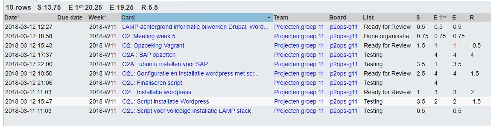
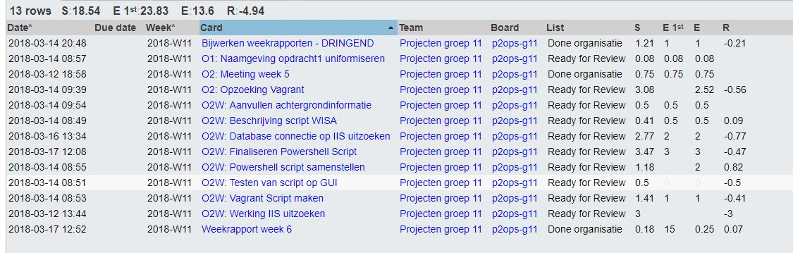
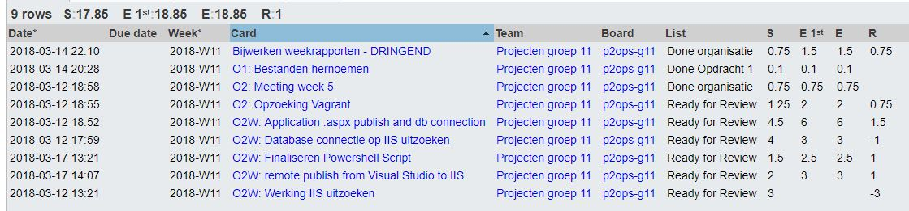
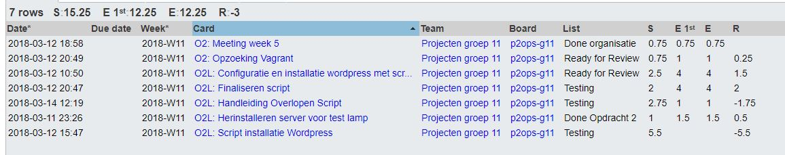

# Voortgangsrapport week 6

* Groep: 11
* Datum: 17/03/2018

| Student             | Aanw. | Opmerking |
| :---                | :---  | :---      |
| De Cock Robin       |   x   |     /     |
| Eggemont Rob        |   x   |     /     |
| El Kaddouri Ismail  |   x   |     /     |
| Vandeveire Thomas   |   x   |     /     |

## Wat heb je deze week gerealiseerd?

### Algemeen

[Afbeelding huidige toestand Kanban-bord(en) invoegen]

* Powershell Script volledig afgewerkt
* LAMP Script volledig afgewerkt
* Vagrant boxes online geplaatst (EggermontRob\WISA, EggermontRob\LAMP)
* VagrantFile geschreven
* SAP opdracht uitvoeren en testen
[Afbeelding teamoverzicht tijdregistratie onderverdeeld per deelopdracht]

### De Cock Robin

* Achtergrondinformatie SAP
* Installatie Ubuntu voor SAP
* Finaliseren LAMP script

### Eggermont Rob

* Weekrapport 6
* Finaliseren Powershell Script
* Problemen met SQL Server volledig oplossen
* Bijwerken weekrapporte,

### El Kaddouri Ismail

* Testen van finaal powershell script
* Bijwerken weekrapporten
* Remote Publishing uitwerken

### Vandeveire Thomas

* Hanleiding LAMP script overlopen
* Opzoeken over Vagrant
* Finaliseren van LAMP script
* Testen van LAMP Script

## Wat plan je volgende week te doen?

### Algemeen
Volgende week werken we alle testplannen uit voor WISA, LAMP en SAP. Ook de SAP opdracht zal afgerond worden. Tenslotte zullen handleidingen worden geschreven voor de LAMP en WISA scripten.
### De Cock Robin
* SAP opdracht uitwerken
* Testplan WISA schrijven
### Eggermont Rob
* Handleiding WISA script
* Testplan LAMP uitvoeren
* Testplan SAP uitschrijven
### El Kaddouri Ismal
* Testplan LAMP
* SAP handleiding schrijven
* Remote Publishing handleiding schrijven
### Vandeveire Thomas
* Testplan WISA Uitvoeren
* Handleiding LAMP script afwerken
* Testplan SAP uitvoeren

## Waar hebben jullie nog problemen mee?

* Bij het afronden van de installatie van de SAP server, krijgen we steeds een error. Deze hopen wij zo snel mogelijk op te lossen.

## Feedback technisch luik

### Algemeen

Windows: veel succes bij het proberen aan elkaar linken van het WISA script / Vagrant installatie.

Automatisering: hoe laat je de klant zijn wachtwoord kiezen? Maak een beleidskeuze.
Wat niet kan, is een installatie die halfweg blijft hangen en wacht op user interactie.

Testplan LAMP: dit is een draft, feedback:
- structureren
- duidelijkere stappen gewenst

### De Cock Robin
### Eggermont Rob
### El Kaddouri Ismal
### Vandeveire Thomas

## Feedback analyseluik

### Algemeen
### De Cock Robin
### Eggermont Rob
### El Kaddouri Ismal
### Vandeveire Thomas

