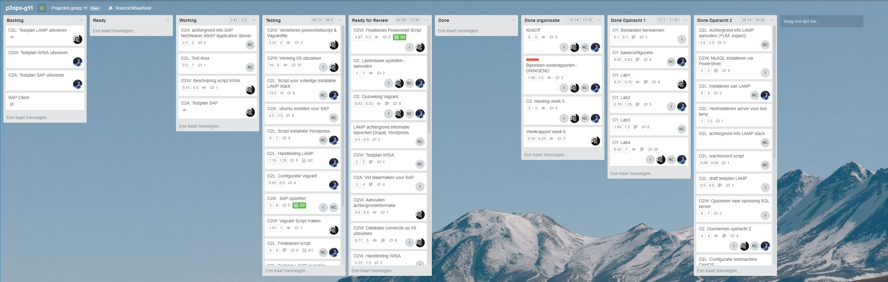
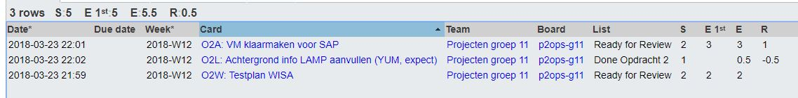
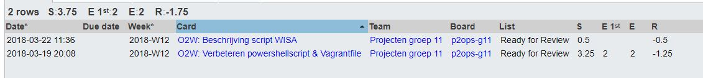
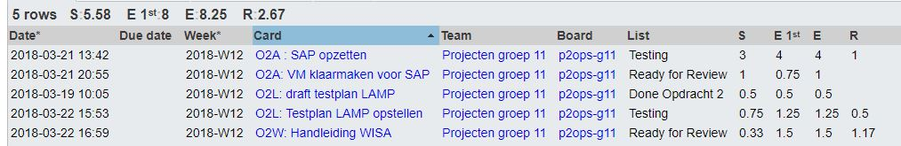
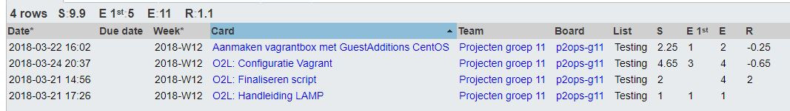

# Voortgangsrapport week 7

* Groep: 11
* Datum: 25/03/2018

| Student             | Aanw. | Opmerking |
| :---                | :---  | :---      |
| De Cock Robin       |   x   |     /     |
| Eggemont Rob        |   x   |     /     |
| El Kaddouri Ismail  |   x   |     /     |
| Vandeveire Thomas   |   x   |     /     |

## Wat heb je deze week gerealiseerd?

### Algemeen

[Afbeelding teamoverzicht tijdregistratie onderverdeeld per deelopdracht]

### De Cock Robin

* O2A: Virtuele machine opzetten voor de SAP Netweaver Omgeving
* O2L: Achtergrondinformatie over LAMP verder aanvullen (YUM, expect)
* O2W: Testplan maken voor WISA

### Eggermont Rob

* O2W: Installatiescript WISA omschrijven in het bestand [Script WISA.md](/opdracht02/Handleiding/Script_WISA.md)
* O2W: Powershell script aanpassen voor vagrant installatie
* O2W: Vagrantfile aanpassen zodat er parameters kunnen worden meegegeven aan het powershellscript

### El Kaddouri Ismail

* O2A: Virtuele machine opzetten voor de SAP Netweaver Omgeving (opensuse)
* O2A: SAP installatie binnen virtuele omgeving
* O2L: Testplan LAMP afwerken
* O2W: Installatie handleiding WISA schrijven

### Vandeveire Thomas

* O2L: Aanmaken van nieuwe vagrantbox (centos7)
* O2L: Aanmaken Vagrantfile
* O2L: Finalisering LAMP Script
* O2L: Installatiehandleiding LAMp schrijven

## Wat plan je volgende week te doen?

### Algemeen
Volgende week verwachten we samen te zitten met de studenten van vastgoed om de opdracht te overlopen en in te kaderen. Verdere schattingen volgen.
### De Cock Robin
### Eggermot Rob
### El Kaddouri Ismail
### Vandeveire Thomas

## Waar hebben jullie nog problemen mee?

* ...
* ...

## Feedback technisch luik

### Algemeen

Het team werkt op een behoorlijke manier naar de einddoelen toe. Keep up the good work.

#### LAMP
Correcte demonstratie van de LAMP stack.
Opmerking: paswoorden zijn default voor nieuwe klanten, die moeten het dan maar veranderen nadien. Dit kon ook in de installatie meegenomen zijn.
Opmerking: sommige scripts zijn gekoppeld aan namen van medewerkers. Vermijdt dit in de toekomst. OB

#### WISA
Correcte installatie van de WISA set-up.
Windows server config.txt: bevat het NAT IP adres, dus het verkeerde adres. 
Demonstratie van IIS server met SQL input werd gedemonstreerd, maar deze stappen kwamen niet duidelijk naar voor in het Testplan van WISA

#### SAP Abap
Installatie is vooraf gemaakt, maar lijkt in orde. Issue: 100G is veel op een laptop.
Testplan: typo sshd
Opmerking: in het testplan wordt enkel de configuratie nagegaan. Het client gedeelte kan niet getest worden.
Zonder client die werkt is dit moeilijk na te gaan. Dit beschouw ik dus niet als volledig te testen.

### De Cock Robin
### Eggermot Rob
### El Kaddouri Ismail
### Vandeveire Thomas

## Feedback analyseluik

### Algemeen

### De Cock Robin
### Eggermot Rob
### El Kaddouri Ismail
### Vandeveire Thomas

